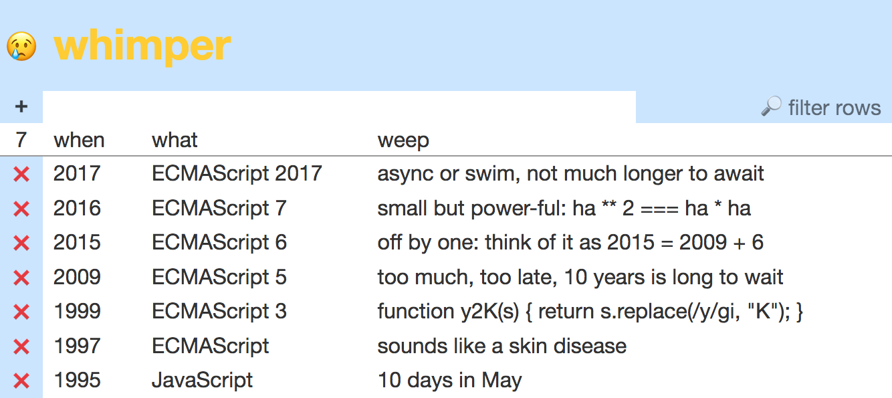
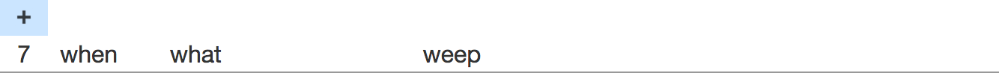
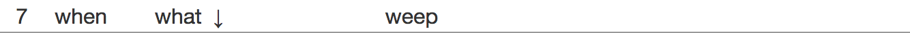
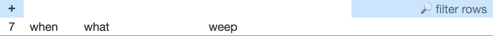
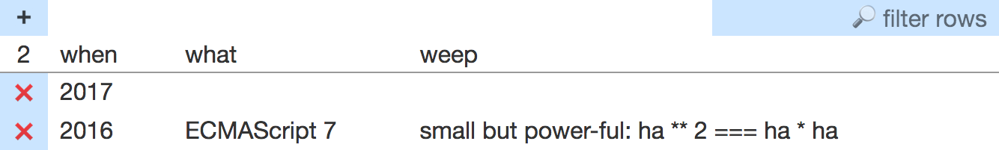
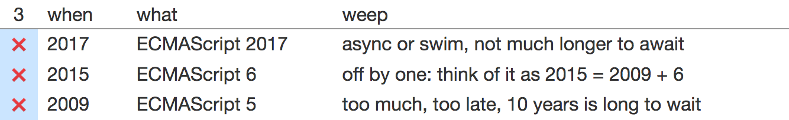
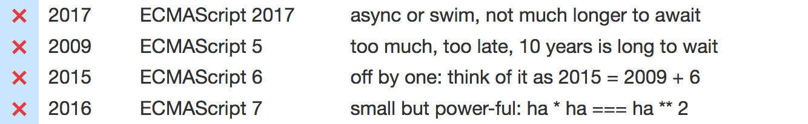
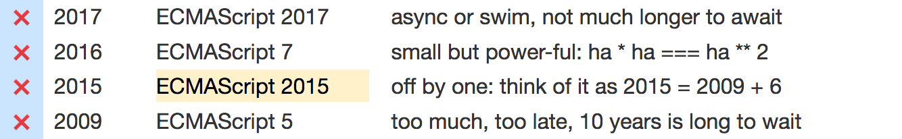

# Example of purposeful testing with Jest 🃏

The **whimper** app is a parody of Twitter that I adapted from Whinepad in *React Up & Running* by Stoyan Stefanov.



## Let’s start with 
the ~~bug~~ big picture

> Dave Ceddia: The main reason to write tests is to ensure 
that your app works the way it should. Test the **high-value** features. You click an “Add to Cart” button. 
The app had better add that item to the cart.

[https://daveceddia.com/what-to-test-in-react-app/](https://daveceddia.com/what-to-test-in-react-app/)

> Marcin Grzywaczewski: When you test React components: Given properties and state, what **structure**? Behavior or **interaction**: is there a possibility 
to transition from state A to state B?

[http://reactkungfu.com/2015/07/approaches-to-testing-react-components-an-overview/](http://reactkungfu.com/2015/07/approaches-to-testing-react-components-an-overview/)

> Stephen Scott: Writing tests defines your component’s **contract**. From an outsider’s perspective, 
is this detail important? Don’t duplicate the application code.

[https://medium.com/@suchipi/the-right-way-to-test-react-components-548a4736ab22](https://medium.com/@suchipi/the-right-way-to-test-react-components-548a4736ab22)

### 4C to communicate when you write a test

* **C**orrect: now of course, but is it practical 
to keep test correct when code changes?
* **C**lear: where to fix code when test fails
* **C**omplete: fewer tests that fit your priorities 
for quality-scope-cost are better than more tests that don’t
* **C**onsistent: apply patterns 
for operations which occur 80% of the time

### Zero configuration testing with Jest

[Jest](http://facebook.github.io/jest/) is already configured 
if you create a project with:

* [create-react-native-app](https://github.com/react-community/create-react-native-app) or [react-native init](facebook.github.io/react-native/docs/getting-started.html)
* [create-react-app](https://github.com/facebookincubator/create-react-app)
  Sometimes we eject this project from `create-react-app` and upgrade Jest to use a critical new feature.
  When `react-scripts` catches up with Jest, we [recreate an unejected config](speakerdeck.com/pedrottimark/
uneject-and-recreate-reactjs-charlotte).

### Only a few other devDependencies

* react-addons-test-utils is peer dependency for enzyme
* [enzyme](http://airbnb.io/enzyme/) returns a wrapper, as in jQuery
  * [shallow](http://airbnb.io/enzyme/docs/api/shallow.html) renders component one level deep, to test it independent of how children are implemented
  * [mount](http://airbnb.io/enzyme/docs/api/mount.html) renders component to full depth in simulated DOM
* [enzyme-to-json](https://github.com/adriantoine/enzyme-to-json) converts enzyme wrapper to test object compatible with `toMatchSnapshot` assertion
* react-test-renderer renders component as test object compatible with `toMatchSnapshot` assertion

## Let’s move to 
a smaller picture

Beware of “one size fits all”

* “Use shallow rendering!”
* “Use snapshot testing!”

Instead, select tools to fit your **goals**.

| Patterns for operations | Examples of tests |
|-------------------------|------------------:|
| **R**ead or **r**ender | TableHead-**R**.test.js |
| **I**nteract | TableHead-**I**.test.js |
| **C**reate | Table-**C**.test.js |
| **D**elete | Table-**D**.test.js |
| **V**iew | Table-**V**.test.js |
| **U**pdate or **u**ndo | Table-**U**.test.js |

### Read or render, part 1

Given combinations of **props** and **state**  as input, 
the component renders correct output:

* what people “see” including accessibility
* what child components receive as props

This first example contrasts two methods.

* Baseline: typical “abstract” assertions

  * simulate child components or DOM nodes
  * traverse by selector
  * assert each expected value, 
but it can be **hard to see** too many criteria

* Proposed: the `toMatchSnapshot` assertion 
matches props and descendants 
in “descriptive” JSX

  A few snapshots which control changes 
to a component do more good than harm,
  * because it’s **easy to see** descriptive criteria,
  * if you know that’s their goal,
  * from the name of the test file. For example, TableHead-**R**.test.js

Example: **table head** renders button, count, and fields



* Baseline: […/pre-sort/src/components/\_\_test0\_\_/TableHead-R.test.js](https://github.com/pedrottimark/whimper/blob/pre-sort/src/components/__test0__/TableHead-R.test.js)
* Proposed: […/pre-sort/src/components/\_\_tests\_\_/TableHead-R.test.js](https://github.com/pedrottimark/whimper/blob/pre-sort/src/components/__tests__/TableHead-R.test.js)

```js
import React from 'react';
import renderer from 'react-test-renderer';

import TableHead from '../TableHead';

describe('TableHead', () => {
  it('renders button, count, and fields', () => {
    expect(renderer.create(
      <TableHead
        addRow={() => {}}
        count={7}
        fields={fields}
      />
    ).toJSON()).toMatchSnapshot();
  });
});
```

### Updating tests, part 1

Example: **sort rows** by fields



To click a column heading and display an indicator, add to `th` elements:

* `onClick` property
* `span` and `abbr` children

```sh
git checkout diff-sort

npm test -- TableHead-R
u
q

git checkout -- src/components/__tests__/__snapshots__/TableHead-R.test.js.snap
git checkout master
```

### Interlude about snapshot testing

**Painless** snapshot testing, to control changes in components:

* Prevent unexpected **regression**. 
If change is incorrect, then fix code.
* Confirm expected **progress**. 
If change is correct, then update snapshot.

**Painful** snapshot testing, if you let the effort get out of balance:

* Too easy to write a test, which you do once.
* Too hard to understand if it fails, unhappily ever after.
  * Which changes are correct or incorrect?
  * Overlook a change that should be, but isn’t?

> Adrien Antoine: The danger of #Jest snapshot testing is **overusing** it, there would be **so much diff** for each code change that you wouldn’t see the actual bug

> Christoph Pojer: I totally agree. We will need to evolve **patterns** over time and figure out the best **balance**.

[https://twitter.com/cpojer/status/774427994077048832](https://twitter.com/cpojer/status/774427994077048832)

> Stephen Scott: A snapshot test does not tell you your code **broke**, only that it **changed**. It is easier to explain exactly which pieces you care about with the imperative approach, but I would love to see 
**tooling** change that opinion.

[https://medium.com/@suchipi/thanks-for-your-response-e8e9217db08f](https://medium.com/@suchipi/thanks-for-your-response-e8e9217db08f)

**Purposeful** testing, when you write a test, minimize:

* irrelevant details, which cause
* unnecessary updates, which risk
* incorrect decisions, especially
* false negatives, failing to report an error

The rest of examples replace `toMatchSnapshot` with `toMatchObject` to 
match a **relevant subset** 
of props and descendants 
in **descriptive** JSX.

Proposed to import from `enzyme-to-json`

* `mountToDeepObject` Given an enzyme `mount` wrapper, especially from selector traversal, return a test object rendered to **maximum** depth. It contains only DOM nodes, no React components.
* `mountToShallowObject` Given an enzyme `mount` wrapper, especially from selector traversal, return a test object rendered to **minimum** depth. It might contain DOM nodes, but any children which are React components are leaves of the tree.

Proposed to import from `react-test-renderer`

* `irrelevant` String sentinel value to **ignore** children, or absence of children, in received object (see below).
* `relevantTestObject` Given a React element, return the **unrendered** element as a test object:
  * `$$typeof` is enumerable
  * `props` is undefined if there are no properties, not including `children`
  * `children` is undefined if it is `[irrelevant]`
* `renderAsTestObject` Given a React element, return the rendered result from `renderer.create(element).toJSON()` as a test object:
  * `$$typeof` is enumerable
  * `children` is slightly normalized to be **compatible** with the preceding functions

| How do you get the relevant JSX? | When |
|:---------------------------------|-----:|
| Type it, based on render method | TDD or non-TDD |
| Copy from existing Read snapshot, and delete whatever is irrelevant | TDD or non-TDD |
| Copy from temporary snapshot, and delete whatever is irrelevant | non-TDD |
| *Maybe someday*, paste by editor integration, and delete… | non-TDD |

### Read or render, part 2

Example: table head renders ascending or descending **
indicator** only in heading of primary sort field


* Baseline: […/pre-filter/src/components/\_\_test0\_\_/TableHead-R.test.js](https://github.com/pedrottimark/whimper/blob/pre-filter/src/components/__test0__/TableHead-R.test.js)
* Proposed: […/pre-filter/src/components/\_\_tests\_\_/TableHead-R.test.js](https://github.com/pedrottimark/whimper/blob/pre-filter/src/components/__tests__/TableHead-R.test.js)

```js
import React from 'react';
import {
  irrelevant,
  relevantTestObject,
  renderAsTestObject,
} from 'react-test-renderer';                             // proposed

import TableHead, {ascending, descending} from '../TableHead';

describe('TableHead', () => {
  it('renders descending indicator in `when` heading', () => {
    expect(renderAsTestObject(
      <TableHead
        addRow={() => {}}
        count={7}
        fields={fields}
        sortRecords={() => {}}
        view={Object.assign({}, viewInitial, {sorting: [
          {fieldKey: 'when', descending: true},
          {fieldKey: 'what', descending: false},
        ]})}
      />
    ).children[1]).toMatchObject(relevantTestObject(
      <tr>
        <th>{irrelevant}</th>
        <th>
          <span>{irrelevant}</span>
          <abbr title="descending">{descending}</abbr>
        </th>
        <th>
          <span>{irrelevant}</span>
          <abbr title=""></abbr>
        </th>
        <th>
          <span>{irrelevant}</span>
          <abbr title=""></abbr>
        </th>
      </tr>
    ));
  });

  // and so on
});
```

### Updating tests, part 2

Example: **filter rows** by substring

To type a substring, add `input` element at right of first `tr`.


* Because the baseline assertion passes, 
you must **remember** to update it.
* Because one proposed snapshot fails, 
you must **decide** to update it.

```sh
git checkout diff-filter

npm test -- TableHead-R
u
q

git checkout -- src/components/__tests__/__snapshots__/TableHead-R.test.js.snap
git checkout master
```

### Interact

If components render simple views of data, or if you don’t have time to apply other patterns, you might test only:

* rendering
* interaction, that 
interface **events** cause correct **actions**

`jest.fn()` returns a mock function, 
also known as a spy, to assert **behavior** of calling code, 
not just output.

Example: **click cells** in table head



* Baseline is same as Proposed: […/master/src/components/\_\_tests\_\_/TableHead-I.test.js](https://github.com/pedrottimark/whimper/blob/master/src/components/__tests__/TableHead-I.test.js)

```js
import React from 'react';
import {mount} from 'enzyme';

import TableHead from '../TableHead';

describe('TableHead', () => {
  const addRow = jest.fn();
  const sortRecords = jest.fn();
  const $it = mount(
    <TableHead
      addRow={addRow}
      count={7}
      fields={fields}
      filterRecords={() => {}}
      sortRecords={sortRecords}
      view={viewInitial}
    />
  );

  // Click every cell in table head.
  $it.find('thead tr').forEach($tr => {
    $tr.find('th').forEach($th => {
      $th.simulate('click');
    });
  });

  // Interface events cause correct actions.

  it('adds a row', () => {
    expect(addRow).toHaveBeenCalledTimes(1);
    expect(addRow).toHaveBeenCalledWith();
  });

  it('sorts rows', () => {
    // [] from click non-field heading at left to reset sort order.
    expect(sortRecords.mock.calls).toEqual([[]].concat(
      fields.map(({key}) => [key])
    ));
  })
});
```

### Create

An action **adds a child** to a component.

* **where**: add to correct place in siblings
* **what**: delegate details about children
* **what else**: update the (derived) state?

Example: **add row** to table body



* Baseline: […/master/src/components/\_\_test0\_\_/Table-C.test.js](https://github.com/pedrottimark/whimper/blob/master/src/components/__test0__/Table-C.test.js)
* Proposed: […/master/src/components/\_\_tests\_\_/Table-C.test.js](https://github.com/pedrottimark/whimper/blob/master/src/components/__tests__/Table-C.test.js)

```js
import React from 'react';
import {mount} from 'enzyme';
import {mountToShallowObject} from 'enzyme-to-json';      // proposed
import {relevantTestObject} from 'react-test-renderer';   // proposed

import Table from '../Table';
const TableRow = () => {}; // mock, and provide only relevant props

const clickAdd = ($it) => {
  $it.find('thead tr').at(0).find('th').at(0).simulate('click');
};

const countRows = ($it) =>
  Number($it.find('thead tr').at(1).find('th').at(0).text());

const tbodyShallow = ($it) =>
  mountToShallowObject($it.find('tbody'));

describe('Table', () =>
  it('creates a row preceding one existing row', () => {
    const store = createStore(reducer);
    const records = [recordB];
    store.dispatch(receiveData(fields, records));
    const $it = mount(
      <Provider store={store}>
        <Table />
      </Provider>
    );

    clickAdd($it);
    expect(countRows($it)).toBe(records.length + 1);
    expect(tbodyShallow($it)).toMatchObject(relevantTestObject(
      <tbody>
        <TableRow record={recordDefault(fields)} />
        <TableRow record={recordB} />
      </tbody>
    ));
  });

  // and so on
});
```

### Delete

An action **removes a child** from a component.

* **where**: remove from correct place in siblings
* **what**: delegate details about children
* **what else**: update the (derived) state?

Example: **delete row** from table body



* Baseline: […/master/src/components/\_\_test0\_\_/Table-D.test.js](https://github.com/pedrottimark/whimper/blob/master/src/components/__test0__/Table-D.test.js)
* Proposed: […/master/src/components/\_\_tests\_\_/Table-D.test.js](https://github.com/pedrottimark/whimper/blob/master/src/components/__tests__/Table-D.test.js)

```js
// Delete is similar to Create

describe('Table deletes records', () => {
  // initialize $it

  test('in the middle', () => {
    clickDelete($it, 1); // recordB
    expect(countRows($it)).toEqual(records.length - 1);
    expect(tbodyShallow($it)).toMatchObject(relevantTestObject(
      <tbody>
        <TableRow record={recordA} />
        <TableRow record={recordC} />
        <TableRow record={recordD} />
      </tbody>
    ));
  });

  // and so on  
});
```

### View

An action **changes derived state** of a component. Apply other patterns:

* **C**reate: filter to “add” children
* **D**elete: filter to “remove” children
* **C**reate and **D**elete: sort to reorder children
* **U**pdate: indicate state in user interface

Example: **sort rows** by fields



* Baseline: […/master/src/components/\_\_test0\_\_/Table-V.test.js](https://github.com/pedrottimark/whimper/blob/master/src/components/__test0__/Table-V.test.js)
* Proposed: […/master/src/components/\_\_tests\_\_/Table-V.test.js](https://github.com/pedrottimark/whimper/blob/master/src/components/__tests__/Table-V.test.js)

```js
// View is similar to Create and Delete

describe('Table sorting', () => {
  // initialize $it

  it('is ascending on click `what` heading', () => {
    clickHeading($it, 1);
    expect(tbodyShallow($it)).toMatchObject(relevantTestObject(
      <tbody>
        <TableRow record={recordA} />
        <TableRow record={recordD} />
        <TableRow record={recordC} />
        <TableRow record={recordB} />
      </tbody>
    ));
  });

  // and so on  
});
```

### Update or undo

An action **changes the state** of a component.

Assert relevant attributes, content, or structure:

* **prev** state: before the action
* **next** state: after the action
* **prev** state: undo the action

Example: **input or edit text** in table cell



* Baseline: […/master/src/components/\_\_test0\_\_/Table-U.test.js](https://github.com/pedrottimark/whimper/blob/master/src/components/__test0__/Table-U.test.js)
* Proposed: […/master/src/components/\_\_tests\_\_/Table-U.test.js](https://github.com/pedrottimark/whimper/blob/master/src/components/__tests__/Table-U.test.js)

```js
import React from 'react';
import {mount} from 'enzyme';
import {mountToDeepObject} from 'enzyme-to-json';         // proposed
import {relevantTestObject} from 'react-test-renderer';   // proposed

import Table from '../Table';

describe('Table', () => {
  it('updates a text field', () => {
    // initialize $td

    $td.simulate('doubleClick');
    const textInitial = records[rowIndex][fields[fieldIndex].key];
    expect(mountToDeepObject($td)).toMatchObject(relevantTestObject(
      <td>
        <div>
          <span>{textInitial}</span>
          <form>
            <input
              defaultValue={textInitial}
              type="text"
            />
          </form>
        </div>
      </td>
    ));

    const textUpdated = 'ECMAScript 2015';
    $td.find('input').get(0).value = textUpdated;

    $td.find('form').simulate('submit');
    expect(mountToDeepObject($td)).toMatchObject(relevantTestObject(
      <td>{textUpdated}</td>
    ));
  });
});
```

## Conclusion

> Antoine de Saint Exupéry: It seems that perfection is attained not when there is nothing more to add, but when there is nothing more to **remove**.

* Baseline: add as many abstract assertions as you can?
* Proposed: **delete** as many **irrelevant** details as you can!

> Dmitrii Abramov: testing pyramid in 2016

[https://twitter.com/abramov_dmitrii/status/805913874704674816](https://twitter.com/abramov_dmitrii/status/805913874704674816)
